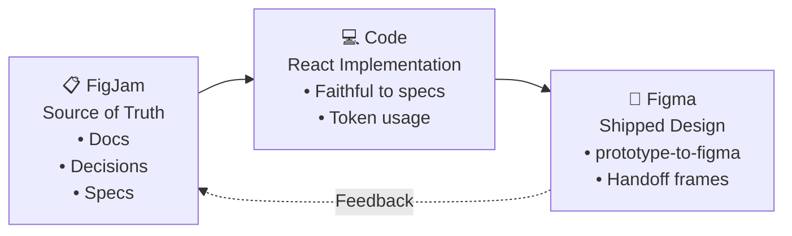
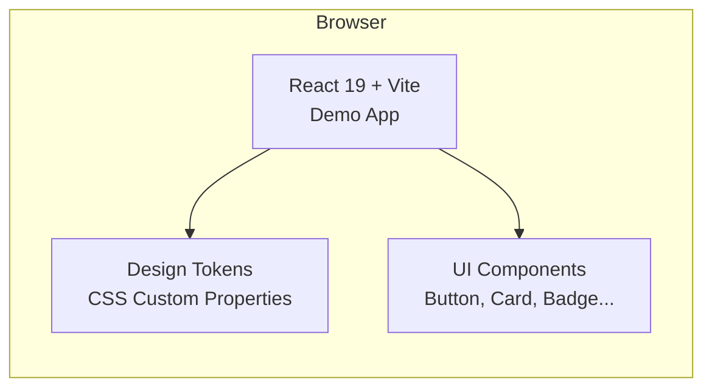

# Diagrams for the FigJam Board (copy ideas or Mermaid)

## 1. Main Workflow Loop (recommended for top-right area)



**How to use in FigJam**:
- Create three large rounded rectangles
- Add text inside
- Use big arrows/connectors between them
- Small curved arrow going back labeled "Feedback / Updates"

## 2. Current Architecture (simple)



**In FigJam**:
- Draw a big browser window shape on the left
- Inside it: three smaller boxes stacked or side by side

## 3. Component Spec Example (for the Component Library section)

You can draw this as a small card anatomy:

```
┌────────────────────────────┐
│          Card              │
│  ┌──────┐   Title         │
│  │ Icon │   Body text...  │
│  └──────┘                  │
│  [Primary]  [Secondary]    │
└────────────────────────────┘
States: Default | Hover
```

---

## Quick Shapes Suggestion (for manual creation)

When building the board:
- Use **Section** for the big content areas (left side)
- Use regular **shapes** (rounded rect) for diagram boxes
- Use **connectors** (with arrow heads) for flows
- Use **stickies** for the Success Metrics and Open Questions
- Use **table** for the Implementation Status (FigJam supports tables)

This will give it a nice organized project-plan look.
